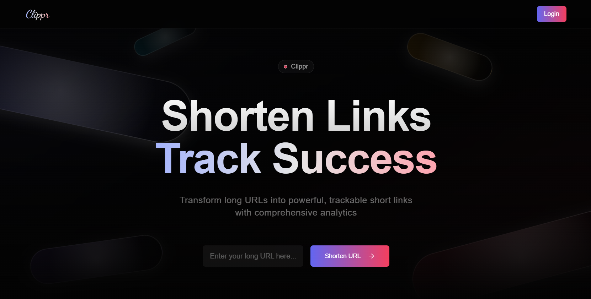

<div align="center">
 <br />
    <a href="https://clipr.vercel.app" target="_blank">
      
    </a>
  <br />

  <div>
    
    
    
    
    
  </div>
  
  <h3 align="center">Clipper - A Full Stack URL Shortener</h3>
  
See the deployed project [here](https://clipr.vercel.app).
</div>


## 📋 <a name="table">Table of Contents</a>

1. 🤖 [Introduction](#introduction)
2. ⚙️ [Tech Stack](#tech-stack)
3. 🔋 [Features](#features)
4. 🤸 [Quick Start](#quick-start)

## <a name="introduction">🤖 Introduction</a>

Clipper is a full-stack URL Shortener built using **Next.js**, **Supabase**, **ShadCN UI**, and **Tailwind CSS**. It allows users to **shorten long URLs**, **track analytics**, and **manage their links** efficiently.

With Clipper, users can:
- Generate short, shareable links.
- View detailed analytics for each shortened URL.
- Manage and organize their links from a user-friendly dashboard.

The project is designed for simplicity, and ease of use, making URL shortening seamless and efficient.


## <a name="tech-stack">⚙️ Tech Stack</a>

- Next.js
- JavaScript
- Supabase
- ShadCN UI
- Tailwind CSS

## <a name="features">🔋 Features</a>

👉 **Shorten Long URLs** – Easily convert long and complex URLs into short, manageable links.

👉 **User Authentication** – Secure authentication using Supabase with email/password.

👉 **Custom Short URLs** – Allows users to create custom slugs for personalized short URLs.

👉 **Dashboard for Link Management** – Users can view, edit, and delete their shortened links from an intuitive dashboard.

### 👉 **Analytics Tracking**

🔹 **Location Stats** – Track the geographic locations of visitors who click on your shortened links.

🔹 **Device Stats** – Monitor the types of devices (mobile, desktop, tablet) used to access your links.

👉 **SEO-Friendly and Optimized Performance** – Fast-loading, optimized pages built with Next.js and Tailwind CSS.

## <a name="quick-start">🤸 Quick Start</a>

Follow these steps to set up the project locally on your machine.

**Prerequisites**

Make sure you have the following installed on your machine:

- [Git](https://git-scm.com/)
- [Node.js](https://nodejs.org/en)
- [npm](https://www.npmjs.com/) (Node Package Manager)

**Cloning the Repository**

```bash
git clone https://github.com/MohammedHamza0631/clippr.git
cd clippr
```

**Installation**

Install the project dependencies using npm:

```bash
npm install
```

**Set Up Environment Variables**

Create a new file named `.env` in the root of your project and add the following content:

```env
NEXT_PUBLIC_SUPABASE_URL=<SUPABASE_PROJECT_URL>
NEXT_PUBLIC_SUPABASE_KEY=<SUPABASE_ANON_KEY>
NEXT_PUBLIC_IPINFO_TOKEN=<IPINFO_API_TOKEN>
```

Replace the placeholder values with your actual credentials. You can obtain these credentials by signing up on the corresponding websites from [Supabase](https://supabase.com/), and [Ipinfo](https://ipinfo.io/).


**Running the Project**

```bash
npm run dev
```

Open [http://localhost:3000](http://localhost:3000) in your browser to view the project.

---
