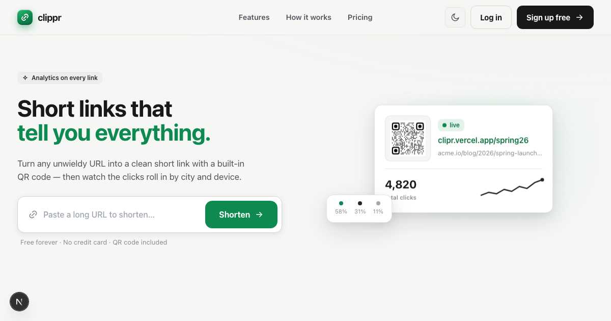

<div align="center">
  <br />
  <a href="https://clipr.vercel.app" target="_blank">
    
  </a>
  <br />

  <div>
    
    
    
    
    
  </div>

  <h3 align="center">Clippr — Short links that tell you everything</h3>

  See the live project at <a href="https://clipr.vercel.app">clipr.vercel.app</a>.
</div>

## Table of Contents

1. [Introduction](#introduction)
2. [Tech Stack](#tech-stack)
3. [Features](#features)
4. [Quick Start](#quick-start)
5. [Environment Variables](#environment-variables)
6. [Database Schema](#database-schema)

## Introduction

Clippr is a full-stack URL shortener built with **Next.js 16**, **Supabase**, and **Tailwind CSS**. Paste a long URL, get a short link and a QR code, then track every click by city and device.

## Tech Stack

| Layer | Choice |
|---|---|
| Framework | Next.js 16 (App Router) |
| Language | JavaScript (JSX) |
| Styling | Tailwind CSS v3 + custom design system |
| Auth & DB | Supabase (email/password, Postgres, Storage) |
| Rate limiting | Upstash Redis |
| Deployment | Vercel |

## Features

- **URL Shortening** — Generate a short link from any URL in seconds
- **Custom aliases** — Choose your own slug (e.g. `clipr.vercel.app/launch`)
- **QR codes** — Every link gets a high-res QR code, live preview while typing
- **Click analytics** — Track total clicks, top cities, and device breakdown
- **User dashboard** — View, search, copy, and delete all your links
- **Authentication** — Secure email/password auth via Supabase
- **Rate limiting** — Sliding-window rate limiting on all API operations
- **Mobile-friendly** — Vaul drawer on mobile for creating links

## Quick Start

**Prerequisites:** Git, Node.js ≥ 20, pnpm

```bash
git clone https://github.com/MohammedHamza0631/clippr.git
cd clippr
pnpm install
```

Copy `.env.local.example` to `.env.local` and fill in the values (see below), then:

```bash
pnpm dev
```

Open [http://localhost:3000](http://localhost:3000).

## Environment Variables

Create `.env.local` in the project root:

```env
# Supabase — get from your project's API settings
NEXT_PUBLIC_SUPABASE_URL=your_supabase_url
NEXT_PUBLIC_SUPABASE_ANON_KEY=<anon-key>
SUPABASE_SERVICE_ROLE_KEY=<service-role-key>

# Upstash Redis — for rate limiting (falls back to in-memory if omitted)
UPSTASH_REDIS_REST_URL=<url>
UPSTASH_REDIS_REST_TOKEN=<token>

# ipinfo.io — for geolocation on clicks
IPINFO_TOKEN=<token>
```

> **Note:** `SUPABASE_SERVICE_ROLE_KEY` bypasses Row Level Security and must never be prefixed with `NEXT_PUBLIC_`.

## Database Schema

### `urls`

| Column | Type | Description |
|---|---|---|
| id | int8 | Primary key |
| created_at | timestamptz | Creation time |
| user_id | uuid | FK → auth.users |
| title | text | Link title |
| original_url | text | Destination URL |
| short_url | text | 6-char generated code |
| custom_url | text | User-defined alias (optional) |
| qr_code | text | Supabase Storage URL |

### `clicks`

| Column | Type | Description |
|---|---|---|
| id | int8 | Primary key |
| created_at | timestamptz | Click time |
| url_id | int8 | FK → urls |
| city | text | Visitor city |
| country | text | Visitor country |
| device | text | `mobile` / `desktop` / `tablet` |
